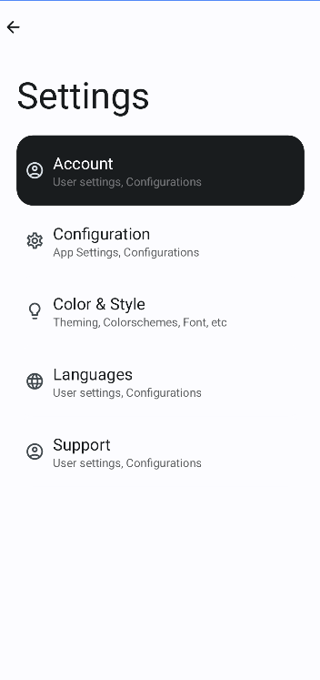

# MU Student Portal

The revamped open-source ported version of the [Student Portal](https://play.google.com/store/apps/details?id=eg.edu.mans.mustudentportal) Android application.

## Light Mode

     &nbsp;
     &nbsp;
     &nbsp;
     &nbsp;

## Dark Mode

     &nbsp;
     &nbsp;

## Installation

Git clone the project then build it, or install the bundled APK file from the [releases section](https://github.com/z0xyz/mustudentportal/releases).

## Contributing

Pull requests are welcome. For major changes, please open an issue first
to discuss what you would like to change.

## License

[MIT](./LICENSE)
